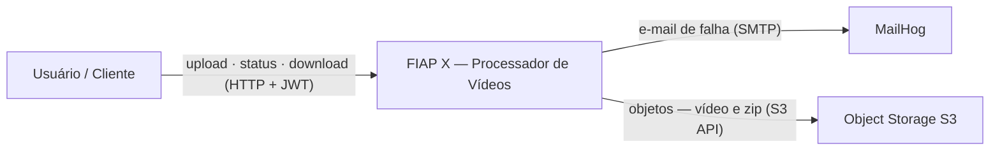
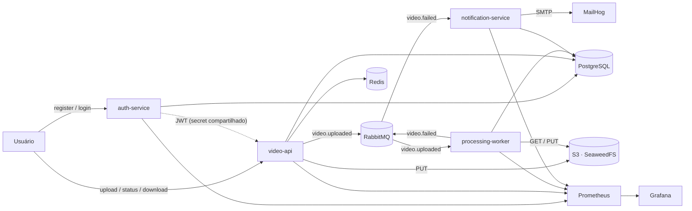
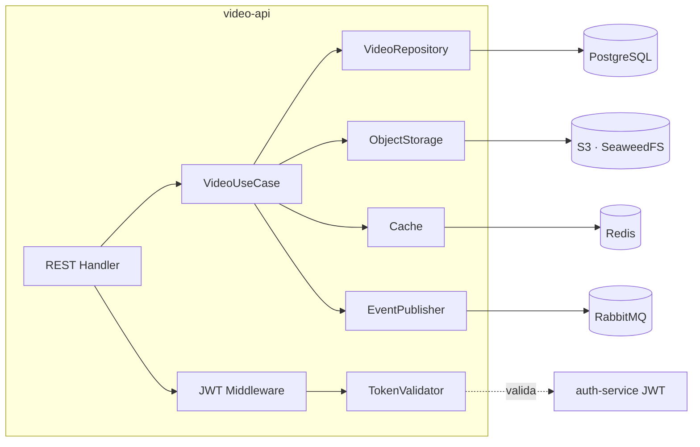
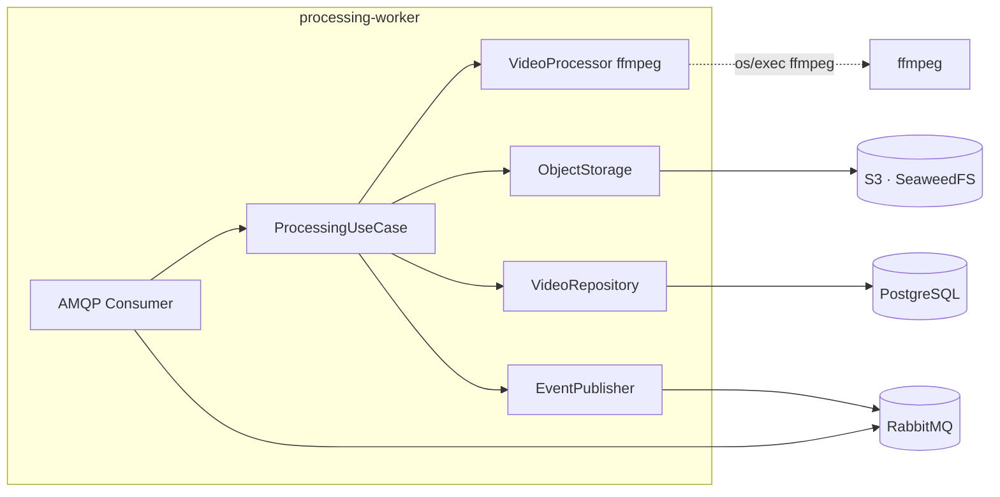

# Diagramas C4 — FIAP X (Processador de Vídeos)

## Nível 1 — Contexto

```mermaid
flowchart LR
    U[Usuário / Cliente] -->|"upload · status · download (HTTP + JWT)"| S["FIAP X — Processador de Vídeos"]

    S -->|"e-mail de falha (SMTP)"| MH[MailHog]
    S -->|"objetos — vídeo e zip (S3 API)"| OB["Object Storage S3"]
```

## Nível 2 — Container

```mermaid
flowchart LR
    U[Usuário] -->|"register / login"| A[auth-service]
    U -->|"upload / status / download"| V[video-api]

    A -.->|"JWT (secret compartilhado)"| V

    V -->|"video.uploaded"| R[(RabbitMQ)]
    R -->|"video.uploaded"| W[processing-worker]
    W -->|"video.failed"| R
    R -->|"video.failed"| N[notification-service]

    N -->|"SMTP"| MH[MailHog]

    A --> PG[(PostgreSQL)]
    V --> PG
    W --> PG
    N --> PG

    V --> RD[(Redis)]

    V -->|"PUT"| S3[(S3 · SeaweedFS)]
    W -->|"GET / PUT"| S3

    A --> P[Prometheus]
    V --> P
    W --> P
    N --> P
    P --> G[Grafana]
```

## Nível 3 — Componente (video-api)

```mermaid
flowchart LR
    subgraph video-api
        H[REST Handler] --> UC[VideoUseCase]
        H --> M[JWT Middleware]
        M --> TV[TokenValidator]
        UC --> VR[VideoRepository]
        UC --> OS[ObjectStorage]
        UC --> C[Cache]
        UC --> EP[EventPublisher]
    end

    TV -.->|"valida"| A[auth-service JWT]
    VR --> PG[(PostgreSQL)]
    OS --> S3[(S3 · SeaweedFS)]
    C --> RD[(Redis)]
    EP --> R[(RabbitMQ)]
```

## Nível 3 — Componente (processing-worker)

```mermaid
flowchart LR
    subgraph processing-worker
        C[AMQP Consumer] --> UC[ProcessingUseCase]
        UC --> PR[VideoProcessor ffmpeg]
        UC --> OS[ObjectStorage]
        UC --> VR[VideoRepository]
        UC --> EP[EventPublisher]
    end

    C --> R[(RabbitMQ)]
    PR -.->|"os/exec ffmpeg"| FF[ffmpeg]
    OS --> S3[(S3 · SeaweedFS)]
    VR --> PG[(PostgreSQL)]
    EP --> R
```
